STIX (Structural Variant Index) supports searching every discordant paired-end
and split-read alignment from thousands of sample BAMs or CRAMs for the
existence of an arbitrary SV.  STIX reports a per-sample count of all
concurring evidence. From these counts we can, for example, conclude that an SV
with high-level evidence in many samples is common and an SV with no evidence
is rare. 

## Usage
```
usage:   stix <options>
         options:
             -i  index directory
             -s  slop
             -P  padding base piars for query insertion(default 50)
             -p  PED file
             -B  Sharding file
             -Q  Batch queries in table format(left \t right \t len \t SVtype \t ID)
             -T  Threshold to define STIX_ONE(How many supporting reads define a hit) (default:1)
             -c  Alt file column (default 1)
             -d  PED database file
             -r  right SV region
             -l  left SV region
             -f  VCF file
             -a  List of columns to aggregate over
             -F  Filter samples by PED field query
             -j  JSON output
             -t  SV type (DEL,INS,INV,DUP,BND)
             -L  Length of Insertion(use it when -t INS)
             -R  Relative Erorr Threshold to compare the length of query INS and targeted INS (0.0-1.0) (default:0.15)
             -v  Add sample depth to VCF file
             -S  Give only summary
             -D  Give sample depth array
             -V  Verbose mode(print debug information, will increase output file size greatly)
```


## STIX suite

This repository contains all related tools for using STIX. It includes:

1. STIX  (main program)
2. Giggle (tool for indexing)
3. excord (SV singals extraction for short-read)
4. excordlr (SV singals extraction for long-read)

The bundled toolset will be published as docker images with version numbers. Please note that the version is NOT the stix version, it is the stix-suite version. 


### How to use

Download the docker image with specific version

```
docker pull zhengxc1993/stix-suite:<version>

```

Run tools

```
docker run --rm -u $(id -u):$(id -g) -v /etc/passwd:/etc/passwd zhengxc1993/stix-suite:<version> stix 

```


### Versions


#### 1.0.1
<details>
- stix[b3fedd9]

- giggle[4071cb7]

- excord[v0.2.4]

- excord-lr[v0.1.17]

- stix-merge[1.0.0]


```bash
cd stix-suite
docker build -t stix-suite:1.0.0 -f Dockerfile  versions/1.0.1/
docker tag 784ea063777c zhengxc1993/stix-suite:1.0.1
docker push zhengxc1993/stix-suite:1.0.1
```
</details>


#### 1.0.0

<details>

- stix[b3fedd9]

- giggle[4071cb7]

- excord[v0.2.4]

- excord-lr[v0.1.17]


```bash
stix-suite
docker build -t stix-suite:1.0.0 -f Dockerfile  versions/1.0.0/
docker tag 784ea063777c zhengxc1993/stix-suite:1.0.0
docker push zhengxc1993/stix-suite:1.0.0
```
</details>

## Example(long-read)


### Setup demo

```
git clone https://github.com/zhengxinchang/stix.git
cd stix/demo 
```

### Build index

```
# giggle index
docker run --rm -u $(id -u):$(id -g) -v /etc/passwd:/etc/passwd -v $(pwd):/wkspace/ zhengxc1993/stix-suite:1.0.1  \
    sh -c "cd /wkspace/;  giggle index -i "data/*.bed.gz"  -o ./giggle_idx -s -f"

# stix index
docker run --rm -u $(id -u):$(id -g) -v /etc/passwd:/etc/passwd -v $(pwd):/wkspace/ zhengxc1993/stix-suite:1.0.1  \
    sh -c "cd /wkspace/; stix  -i giggle_idx/ -d stix_idx.db  -p meta.ped  -c 5"

```


### Annotate a single SV


**deletion**
```
docker run --rm -u $(id -u):$(id -g) -v /etc/passwd:/etc/passwd -v $(pwd):/wkspace/ zhengxc1993/stix-suite:1.0.1  \
    sh -c "cd /wkspace/; stix \
                        -i giggle_idx/ \
                        -d stix_idx.db \
                        -s 100  \
                        -t DEL \
                        -l 1:1076253-1076253 \
                        -r 1:1076434-1076434  "
```
output:

```
stix_run_giggle_query: left:1 1076253 1076253   right:1 1076434 1076434
Total   0:1     0:1     0:0:0   0:0:0:0
Giggle_File_Id  Sample  Sex     population      Super_population        Alt_File        Pairend Split
0       demo_hg002_hifi NA      NA      NA      demo_hg002_hifi.bed.gz  0       15
```

**insertion**

```
docker run --rm -u $(id -u):$(id -g) -v /etc/passwd:/etc/passwd -v $(pwd):/wkspace/ zhengxc1993/stix-suite:1.0.1  \
    sh -c "cd /wkspace/; stix \
                        -i giggle_idx/ \
                        -d stix_idx.db \
                        -s 100  \
                        -t INS \
                        -l 1:3477303-3477303  \
                        -r 1:3477303-3479646  "
```

output

```
stix_run_giggle_query: left:1 3477303 3477303   right:1 3477303 3479646
Total   0:1     0:1     0:0:0   0:0:0:0
Giggle_File_Id  Sample  Sex     population      Super_population        Alt_File        Pairend Split
0       demo_hg002_hifi NA      NA      NA      demo_hg002_hifi.bed.gz  0       17
```


**Annotate an VCF file**

```

docker run --rm -v $(pwd):/wkspace/ zhengxc1993/stix-suite:1.0.1  \
    sh -c "cd /wkspace/; stix \
                        -i giggle_idx/ \
                        -d stix_idx.db \
                        -s 100  \
                        -T  5  \
                        -f demo-query.vcf  \
                        | tee ann.vcf 1>/dev/null"

```

output

```
ann.vcf # it should be exactly same with output.ann.vcf.
```

For a specific SV,the `STIX_ZERO` and `STIX_ON`E indicate the `number of positive sample` and `number of negative samples` respectively.
The frequency can be calculated with `STIX_ONE/(STIX_ONE + STIX_ZERO)`.


## Example(short-read)

The following example is based on four sample BAMs from the 1000 Genomes
project:

```
samtools view -b s3://1000genomes/phase3/data/NA12812/alignment/NA12812.mapped.ILLUMINA.bwa.CEU.low_coverage.20130415.bam 13 14 > NA12812.13.14.bam
samtools view -b s3://1000genomes/phase3/data/HG00672/alignment/HG00672.mapped.ILLUMINA.bwa.CHS.low_coverage.20120522.bam 13 14 > HG00672.13.14.bam
samtools view -b s3://1000genomes/phase3/data/NA12878/alignment/NA12878.mapped.ILLUMINA.bwa.CEU.low_coverage.20121211.bam 13 14 > NA12878.13.14.bam
samtools view -b s3://1000genomes/phase3/data/HG00674/alignment/HG00674.mapped.ILLUMINA.bwa.CHS.low_coverage.20121211.bam 13 14 > HG00674.13.14.bam
```

To create an STIX index on short-reads dataset, use `excord` to extract discordant paired-end reads and
split reads.
```
mkdir four_alt
wget -O excord https://github.com/brentp/excord/releases/download/v0.2.2/excord_linux64
chmod +x excord
wget ftp://ftp.1000genomes.ebi.ac.uk/vol1/ftp/technical/reference/phase2_reference_assembly_sequence/hs37d5.fa.gz

for sample in NA12812.13.14 HG00672.13.14 NA12878.13.14 HG00674.13.14; do
    samtools view -b $sample.bam \
    | ./excord \
        --discordantdistance 500 \
        --fasta hs37d5.fa.gz \
        /dev/stdin \
    | LC_ALL=C sort --buffer-size 2G -k1,1 -k2,2n -k3,3n \
    | bgzip -c > four_alt/$sample.bed.gz
done
```

To create an STIX index on long-reads dataset, use `excord-lr` to extract 
split reads.


```
mkdir four_alt
wget -O excord https://github.com/zhengxinchang/excord-lr/releases/download/v0.1.17/excord-lr
chmod +x excord-lr
wget ftp://ftp.1000genomes.ebi.ac.uk/vol1/ftp/technical/reference/phase2_reference_assembly_sequence/hs37d5.fa.gz

for sample in NA12812.13.14 HG00672.13.14 NA12878.13.14 HG00674.13.14; do

    ./excord-lr -b $sample.bam -o $sample.bed

    LC_ALL=C sort --buffer-size 2G -k1,1 -k2,2n -k3,3n $sample.bed \
    > bgzip -c > four_alt/$sample.bed.gz
done
```

Now index with GIGGLE.
```
giggle index -i "four_alt/*gz" -o four_alt_b -s -f
```

STIX requires a PED file that needs at least sample name and discordant
alignment file name, but can support an arbitrary number of columns.
For example:

```
Sample	Sex	Populationzv    Super_Population	Alt_File
NA12812	1	CEU	EUR	NA12812.13.14.bed.gz
HG00672 2	CHS	EAS	HG00672.13.14.bed.gz
NA12878 2	CEU	EUR	NA12878.13.14.bed.gz
HG00674 1	CHS	EAS	HG00674.13.14.bed.gz
```

From a PED file create a database/.
```
stix -i four_alt_b -p test/data/four.ped -d four.ped.db -c 5
```

STIX can query either a single SV or annotate a VCF file. All queries
require a slop parameter that accounts for the variability in the normal
fragment size. In most cases use the mean fragments size plus 3 times the
fragment size standard deviation.

For individual queries, STIX takes the SV type and the left and right positions
of the SV, where left is (by convention) the lower chromosomal position.  Since
many SVs do not have base pair resolution, STIX takes a genomic range for each
side.
```
stix -i four_alt_db -d four.ped.db -s 500 -t DEL -l 14:68603030-68603035 -r 14:68603738-68603743

Total   0:1 0:0 7:8:11  0:2:1:1
Giggle_File_Id  Sample  Sex Population  Super_Population    Alt_File    Pairend Split
0   HG00672 2   CHS EAS HG00672.13.14.bed.gz    8   0
1   HG00674 1   CHS EAS HG00674.13.14.bed.gz    7   0
2   NA12812 1   CEU EUR NA12812.13.14.bed.gz    7   0
3   NA12878 2   CEU EUR NA12878.13.14.bed.gz    11  0
```

For a VCF, STIX uses the `INFO/SVTYPE` field for the SV type and the
`POS`, `INFO/END`, `INFO/CIPOS`, and `INFO/CIEND` fields for the quarry
positions.  STIX annotates each variant with four fields:
* `STIX_ZERO` gives the number of samples that have no evidence for the SV 
* `STIX_ONE` gives the number of samples that have one alignments supporting the SV
* `STIX_QUANTS` has three values that are the quantiles for the per sample count of alignments supporting the SV
* `STIX_QUANT_DEPTHS` has four values that give the number of samples with SV an evidence count that is
  1. between 2 and the quantile one value number of alignments 
  2. between quantile one to quantile two
  3. quantile two to quantile three
  4. more than quantile three
```
stix -i four_alt_db -d four.ped.db -s 500 -f 1kg.four.13.14.vcf.gz
```


## Build
```
git clone https://github.com/ryanlayer/giggle.git
cd giggle
make
cd ..
wget http://www.sqlite.org/2017/sqlite-amalgamation-3170000.zip
unzip sqlite-amalgamation-3170000.zip
git clone https://github.com/ryanlayer/stix.git
cd stix
make
```

## Sample results
### DEL

#### 19:12694867-12698924
##### STIX
    STIX_ZERO STIX_ONE STIX_QUANTS STIX_QUANT_DEPTHS
    0         0        0,4,11      0,0,1,1
##### 1KG low-coverge SV callset (Sudmant et al., Nature 2015) ([VCF](ftp://ftp.1000genomes.ebi.ac.uk/vol1/ftp/phase3/integrated_sv_map/), [Paper](http://www.nature.com/nature/journal/v526/n7571/full/nature15394.html))
    #CHROM POS       REF ALT   INFO                                        NA12878 NA12890 NA12889
    19     12694867  G   <CN0> CIEND=0,1;CIPOS=0,1;END=12698924            1|1     1|1     1|1
##### SVTYPER high-coverage genotypes
             GT  GQ  SQ     GL         DP RO AO QR QA RS AS ASC RP AP AB
    NA12878  1/1 13  796.49 -82,-3,-2  40 9  30 9  30 0  0  0   9  30 0.77    
    NA12890  1/1 10  609.94 -63,-3,-2  31 7  23 7  23 0  0  0   7  23 0.77
    NA12889  0/1 139 794.47 -80,-1,-15 68 33 34 32 33 20 0  0   12 33 0.51
##### LUMPY/SVTYPER high-coverage calls
    #CHROM POS       REF ALT   INFO                                        NA12878 NA12890 NA12889
    19     12694907  N  <DEL>  CIPOS=-10,69;CIEND=-59,4;END=12698928       1/1     1/1     1/1
High coverage | Low coverage
--------------|-------------
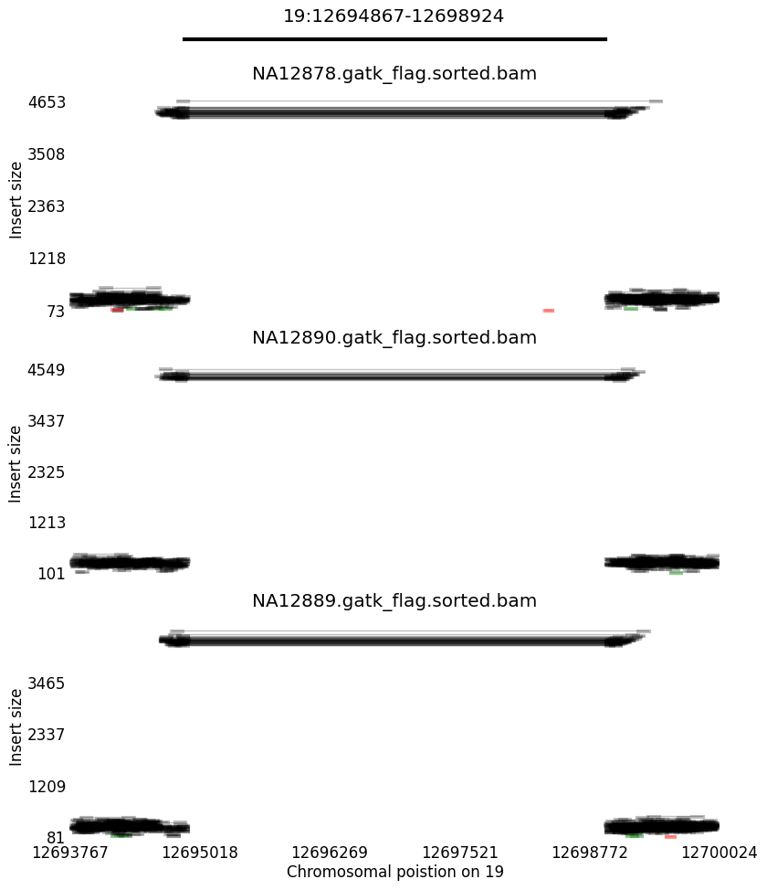 | 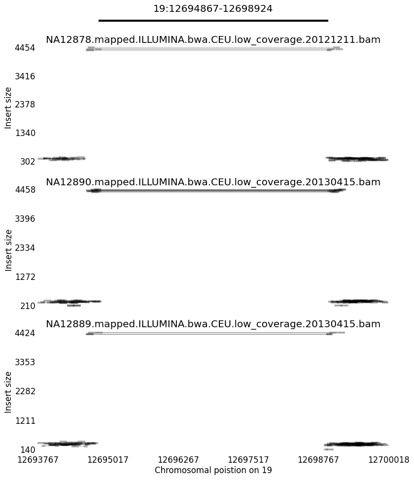


---


#### 5:1022803-1025877
##### STIX
    STIX_ZERO STIX_ONE STIX_QUANTS STIX_QUANT_DEPTHS
    3         0        0,0,0       0,0,0,0
##### 1KG low-coverge SV callset (Sudmant et al., Nature 2015) ([VCF](ftp://ftp.1000genomes.ebi.ac.uk/vol1/ftp/phase3/integrated_sv_map/), [Paper](http://www.nature.com/nature/journal/v526/n7571/full/nature15394.html))
    #CHROM POS       REF ALT   INFO                                        NA12878 NA12890 NA12889
    5      1022803   C   <CN0> CIEND=-500,1000;CIPOS=-1000,500;END=1025877 1|1     1|1     1|1
##### SVTYPER high-coverage genotypes
             GT  GQ  SQ   GL          DP  RO  AO QR  QA RS AS ASC RP AP AB
    NA12878  0/0 200 0.00 -0,-18,-61  62  62  0  61  0  27 0  0   34 0  0
    NA12890  0/0 200 0.00 -0,-23,-78  78  78  0  78  0  37 0  0   41 0  0
    NA12889  0/0 200 0.00 -0,-33,-109 110 109 0  109 0  55 0  0   54 0  0
##### LUMPY/SVTYPER high-coverage calls
    N/A
High coverage | Low coverage
--------------|-------------
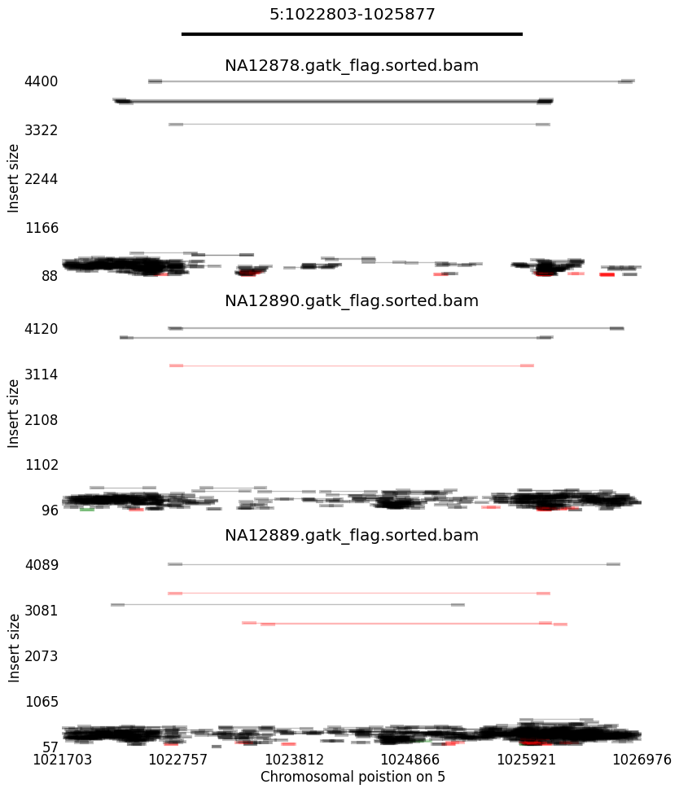 | 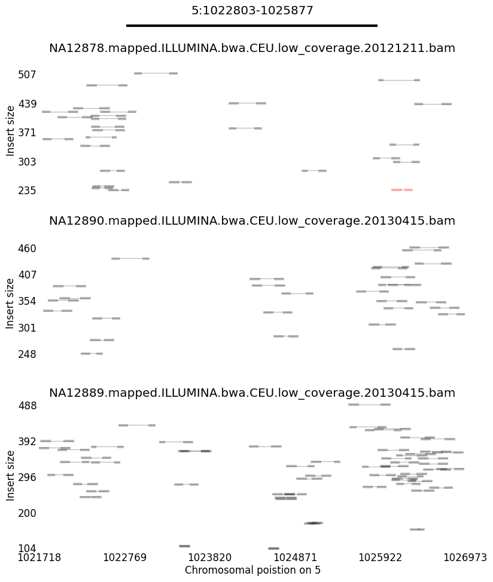


---


#### 4:113985874-113986369
##### STIX
    STIX_ZERO STIX_ONE STIX_QUANTS STIX_QUANT_DEPTHS
    0         0        4,8,10      0,1,1,1
##### 1KG low-coverge SV callset (Sudmant et al., Nature 2015) ([VCF](ftp://ftp.1000genomes.ebi.ac.uk/vol1/ftp/phase3/integrated_sv_map/), [Paper](http://www.nature.com/nature/journal/v526/n7571/full/nature15394.html))
    #CHROM POS        REF ALT   INFO                                        NA12878 NA12890 NA12889
    4      113985874  .   <DEL> END=113986369                               0|0     0|0     0|0
##### SVTYPER high-coverage genotypes
             GT  GQ  SQ      GL         DP RO AO QR QA RS AS ASC RP AP AB
    NA12878  1/1 24  1484.47 -152,-6,-3 74 17 56 17 56 0  0  0   17 56 0.77
    NA12890  0/1 105 446.67  -46,-1,-11 42 22 19 22 19 0  0  0   22 19 0.46
    NA12889  0/1 21  1259.40 -129,-3,-6 71 21 49 21 49 0  0  0   21 49 0.7
##### LUMPY/SVTYPER high-coverage calls
    #CHROM POS        REF ALT   INFO                                        NA12878 NA12890 NA12889
    4      113985951  .   <DEL> CIPOS=-12,2;CIEND=-51,12;END=113986325      1/1     0/1     1/1
High coverage | Low coverage
--------------|-------------
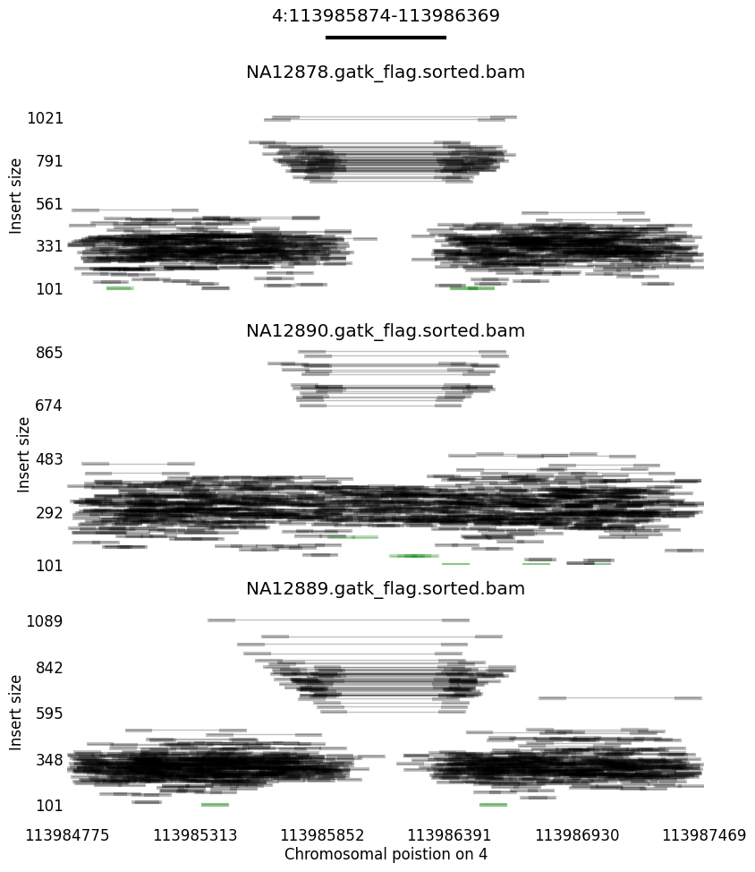 | 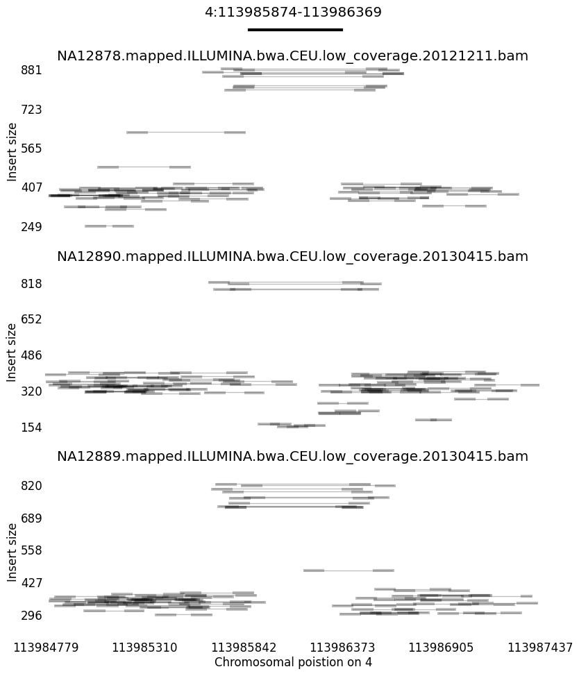


### DUP
### INS

### INV
#### 12:12544868-12546613
##### STIX
##### 1KG low-coverge SV callset (Sudmant et al., Nature 2015) ([VCF](ftp://ftp.1000genomes.ebi.ac.uk/vol1/ftp/phase3/integrated_sv_map/), [Paper](http://www.nature.com/nature/journal/v526/n7571/full/nature15394.html))
    #CHROM POS        INFO                                                       NA12878 NA12890 NA12889
    12      12544792  END=12546607;CIEND=-21,21;CIPOS=-21,21;AC=4129;AF=0.824481 1|1     1|1     1|1
##### SVTYPER high-coverage genotypes
             GT  SU PE SR GQ  SQ      GL          DP RO AO QR QA RS AS ASC RP AP AB
    NA12878  0/1 58 58 0  114 1478.17 -150,-2,-14 99 39 60 38 59 20 0  2   18 57 0.61
    NA12890  1/1 54 54 0  25  1356.74 -139,-5,-3  67 15 51 15 51 0  0  0   15 51 0.77
    NA12889  0/1 46 46 0  200 1073.26 -108,-1,-22 94 47 46 47 45 26 0  1   21 44 0.49
##### LUMPY/SVTYPER high-coverage calls
    #CHROM POS        INFO                                   NA12878 NA12890 NA12889
    12     12544868   END=12546613;CIPOS=-2,17;CIEND=-15,19; 0/1     1/1     0/1
High coverage | Low coverage
--------------|-------------
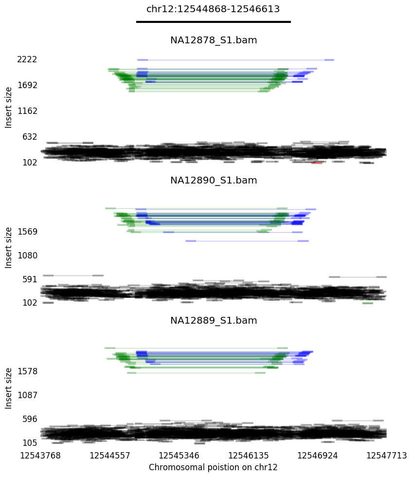 | 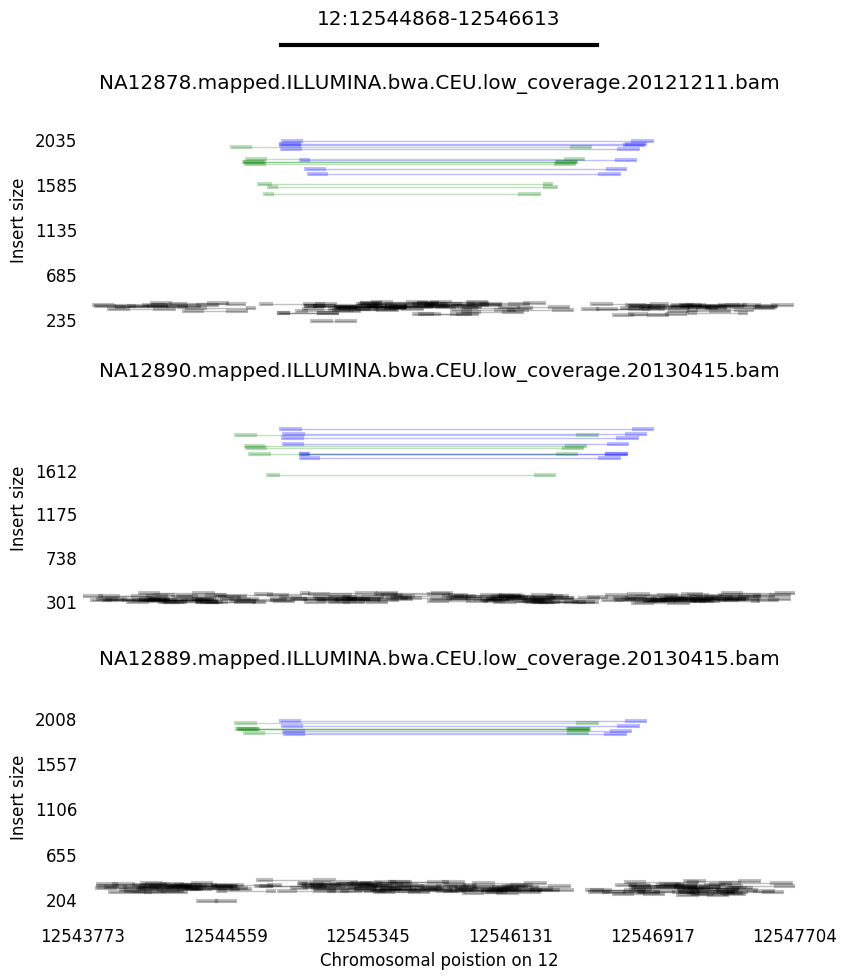

---


#### 12:47290448-47309758
##### STIX
##### 1KG low-coverge SV callset (Sudmant et al., Nature 2015) ([VCF](ftp://ftp.1000genomes.ebi.ac.uk/vol1/ftp/phase3/integrated_sv_map/), [Paper](http://www.nature.com/nature/journal/v526/n7571/full/nature15394.html))
    #CHROM POS      INFO                                                        NA12878 NA12890 NA12889
    12     47290470 END=47309756;CIEND=-55,55;CIPOS=-55,55;AC=248;AF=0.0495208  0|0     0|0     1|0
##### SVTYPER high-coverage genotypes
             GT  SU PE SR GQ  SQ     GL          DP  RO  AO QR  QA RS AS ASC RP AP AB
    NA12878  0/0 0  0  0  200 0.00   -0,-39,-130 131 131 0  130 0  64 0  0   66 0  0
    NA12890  0/0 0  0  0  200 0.00   -0,-35,-115 116 116 0  115 0  56 0  0   59 0  0
    NA12889  0/1 79 56 23 146 578.17 -65,-7,-59  120 87  32 86  31 38 0  9   48 22 0.26
##### LUMPY/SVTYPER high-coverage calls
    #CHROM POS      INFO                                   NA12878 NA12890 NA12889
    12     47290448 END=47309758;CIPOS=-3,2;CIEND=-10,5;   0/0     0/0     0/1
High coverage | Low coverage
--------------|-------------
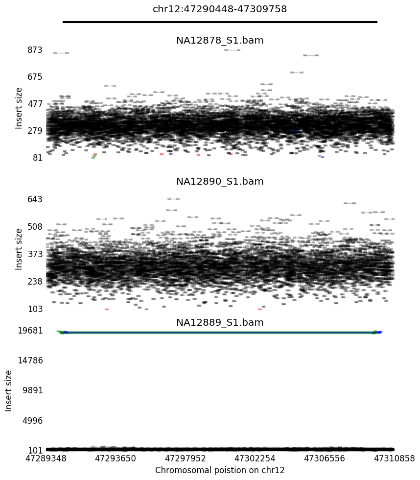 | 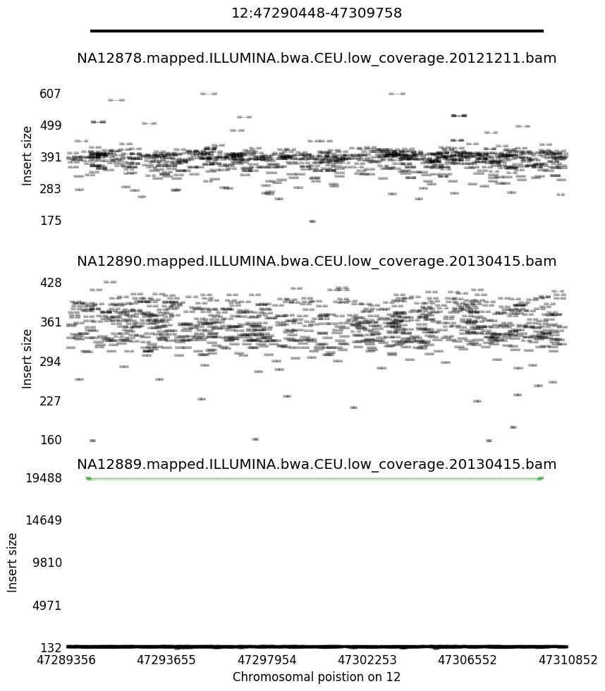

#### 2:89161083-89185670
##### STIX
##### 1KG low-coverge SV callset (Sudmant et al., Nature 2015) ([VCF](ftp://ftp.1000genomes.ebi.ac.uk/vol1/ftp/phase3/integrated_sv_map/), [Paper](http://www.nature.com/nature/journal/v526/n7571/full/nature15394.html))
    N/A
##### SVTYPER high-coverage genotypes
             GT  SU PE SR GQ  SQ     GL         DP  RO AO QR QA RS AS ASC RP AP AB 
    NA12878  0/1 0  0  0  4   53.14  -6,-0,-1   4   1  2  1  2  1  0  2   0  0  0.67
    NA12890  0/0 0  0  0  200 0      -0,-28,-93 94  94 0  93 0  42 0  0   51 0  0
    NA12889  0/1 68 44 24 143 383.23 -48,-9,-65 115 89 25 88 24 42 0  2   46 22 0.21
##### LUMPY/SVTYPER high-coverage calls
    #CHROM POS      INFO                                   NA12878 NA12890 NA12889
    2      89161083 END=89185670;CIPOS=0,0;CIEND=-9,0      0/1     0/0     0/1
High coverage | Low coverage
--------------|-------------
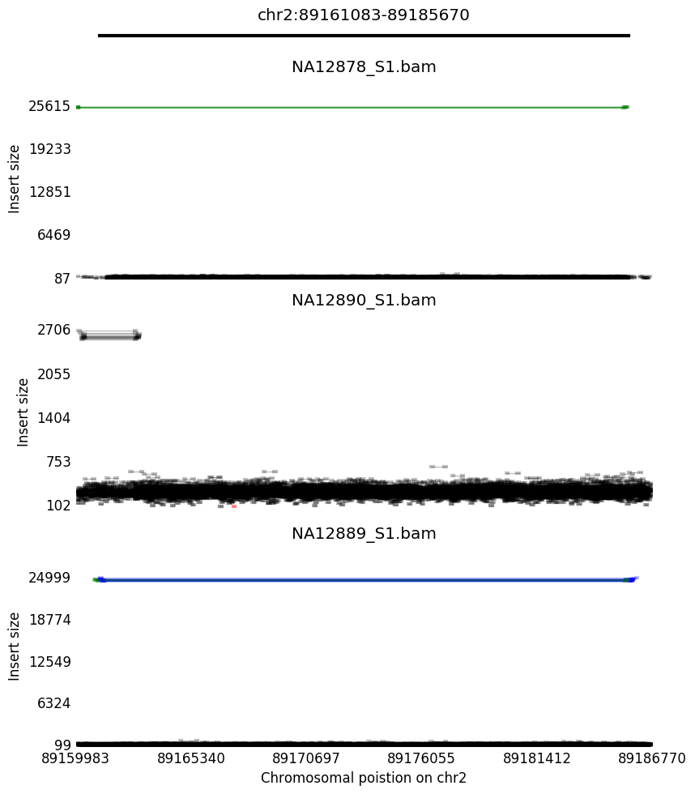 | 
