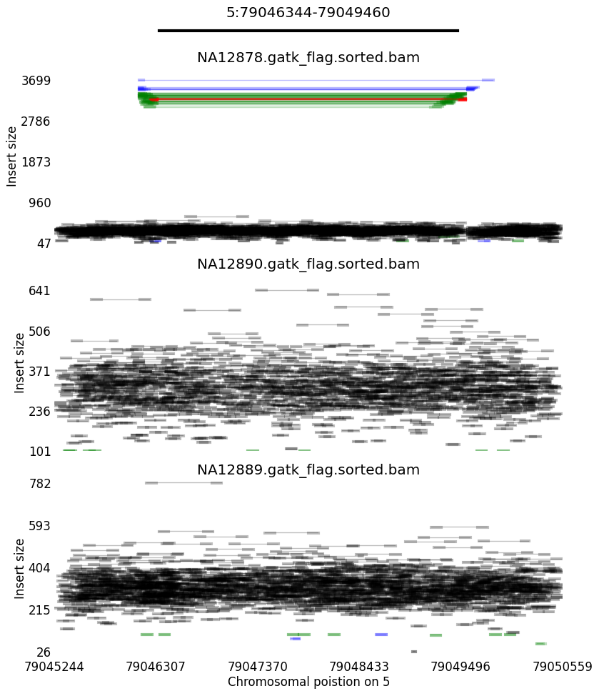
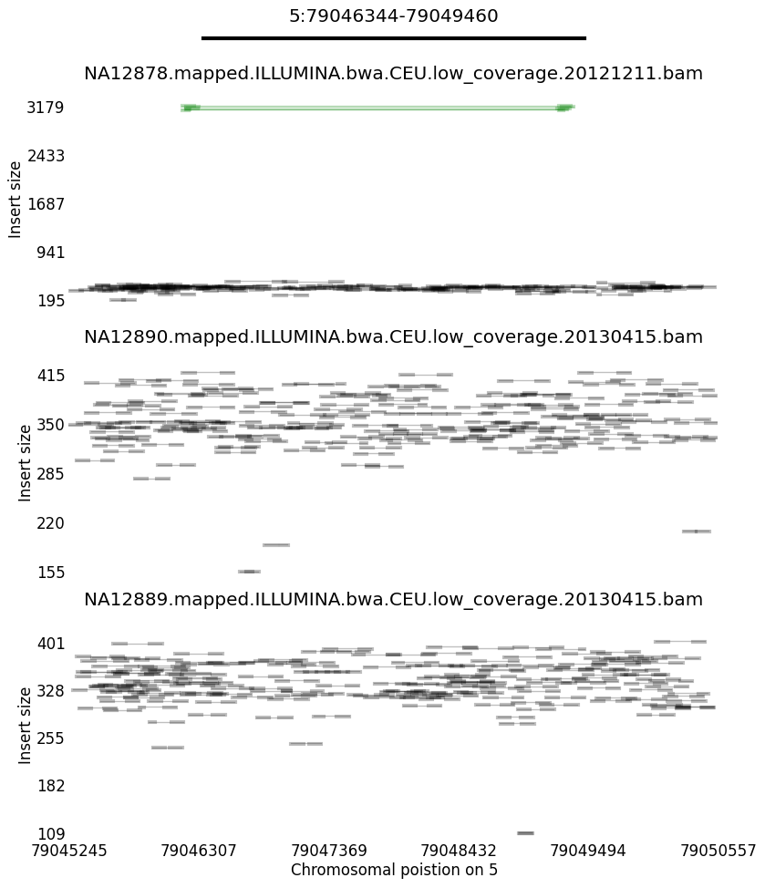
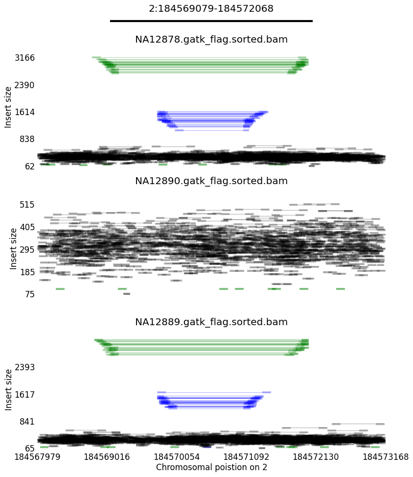
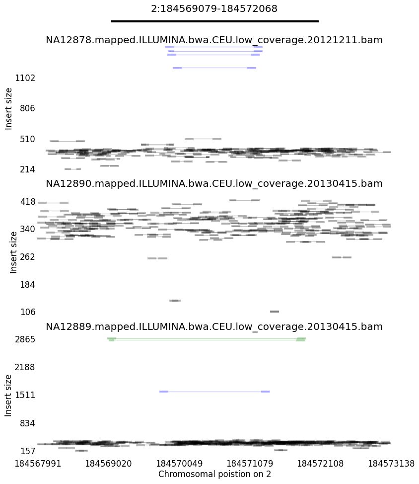

# STIX

## Build
    git clone https://github.com/ryanlayer/giggle.git
    cd giggle
    make
    cd ..
    wget http://www.sqlite.org/2017/sqlite-amalgamation-3170000.zip
    unzip sqlite-amalgamation-3170000.zip
    git clone https://github.com/ryanlayer/stix.git
    make

## Examples
### DEL

#### 19:12694867-12698924
##### STIX
    STIX_ZERO STIX_ONE STIX_QUANTS STIX_QUANT_DEPTHS
    0         0        0,4,11      0,0,1,1

##### 1KG low coverge SV callset (Sudmant et al., Nature 2015) ([VCF](ftp://ftp.1000genomes.ebi.ac.uk/vol1/ftp/phase3/integrated_sv_map/), [Paper](http://www.nature.com/nature/journal/v526/n7571/full/nature15394.html))
    #CHROM POS       REF ALT   INFO                                        NA12878 NA12890 NA12889
    19     12694867  G   <CN0> CIEND=0,1;CIPOS=0,1;END=12698924            1|1     1|1     1|1
High coverage | Low coverage
--------------|-------------
 | 

---

#### 5:1022803-1025877

##### STIX
    STIX_ZERO STIX_ONE STIX_QUANTS STIX_QUANT_DEPTHS
    3         0        0,0,0       0,0,0,0

##### 1KG low coverge SV callset (Sudmant et al., Nature 2015) ([VCF](ftp://ftp.1000genomes.ebi.ac.uk/vol1/ftp/phase3/integrated_sv_map/), [Paper](http://www.nature.com/nature/journal/v526/n7571/full/nature15394.html))
    #CHROM POS       REF ALT   INFO                                        NA12878 NA12890 NA12889
    5      1022803   C   <CN0> CIEND=-500,1000;CIPOS=-1000,500;END=1025877 1|1     1|1     1|1
High coverage | Low coverage
--------------|-------------
 | 

---

#### 5:144059460-144059732
##### STIX
    STIX_ZERO STIX_ONE STIX_QUANTS STIX_QUANT_DEPTHS
    0         0        4,8,10      0,1,1,1

##### 1KG low coverge SV callset (Sudmant et al., Nature 2015) ([VCF](ftp://ftp.1000genomes.ebi.ac.uk/vol1/ftp/phase3/integrated_sv_map/), [Paper](http://www.nature.com/nature/journal/v526/n7571/full/nature15394.html))
    #CHROM POS        REF ALT   INFO                                        NA12878 NA12890 NA12889
    4      113985874  .   <DEL> END=113986369                               0|0     0|0     0|0
High coverage | Low coverage
--------------|-------------
 | 

### DUP
### INS
### INV

    #CHROM POS        REF ALT   INFO                                        NA12878 NA12890 NA12889
    5      144059460  C   <INV> CIEND=-183,183;CIPOS=-183,183;END=144059732 0|0     0|0     0|1
High coverage | Low coverage
--------------|-------------
 | 

    #CHROM POS        REF ALT   INFO                                        NA12878 NA12890 NA12889
    2      184569079  A   <INV> CIEND=-177,177;CIPOS=-177,177;END=184572068 0|0     0|0     1|0
High coverage | Low coverage
--------------|-------------
 | 

